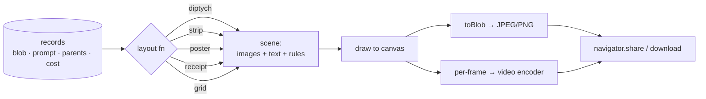
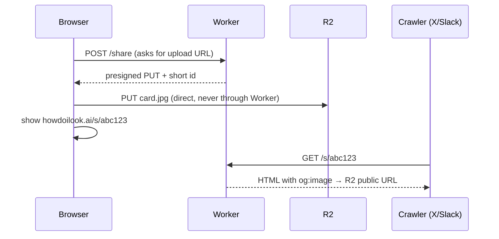

# Sharing options for howdoIlook

A survey of ways to get a tree, a path, or a single edit out of the canvas and onto social media.
Surveyed 2026-09-14 against the current codebase (`share.js`, `image.js`, `layout.js`) and against
what browsers and platforms actually permit today.

## Contents

- [The answer in one paragraph](#the-answer-in-one-paragraph)
- [The hard constraint: what reaches Instagram from a browser](#the-hard-constraint-what-reaches-instagram-from-a-browser)
- [The one architectural decision](#the-one-architectural-decision)
- [Tier 0 — still cards, no backend](#tier-0--still-cards-no-backend)
- [Tier 1 — reels](#tier-1--reels)
- [Tier 2 — the self-contained tree](#tier-2--the-self-contained-tree)
- [Tier 3 — hosted links and unfurls](#tier-3--hosted-links-and-unfurls)
- [The growth loop: remix templates](#the-growth-loop-remix-templates)
- [Risks that matter at scale](#risks-that-matter-at-scale)
- [Recommended build order](#recommended-build-order)
- [Open questions](#open-questions)

## The answer in one paragraph

Build **one canvas renderer** and feed it different layouts — that single component yields every
share card, the tree poster, and every video frame, and it is the only new subsystem needed. Pair it
with `navigator.share({ files })`, which is the *only* path from a web page into the Instagram and
TikTok composers. Everything in Tier 0 and Tier 1 ships with no backend, no new privacy surface, and
roughly one small dependency. Hosted links are a separate, later decision, because they are the point
at which the product stops being "everything stays in your browser".

The most distinctive idea in this document is not the video — it is [the Receipt](#4-the-receipt) and
[remix templates](#the-growth-loop-remix-templates). Images of your face spread narrowly. Formats and
challenges spread widely.

## The hard constraint: what reaches Instagram from a browser

This shapes every option below, so it goes first.

| Path | Works? | Notes |
|---|---|---|
| `navigator.share({ files })` | Yes | Opens the OS share sheet. Instagram, TikTok, WhatsApp, Messages all appear as targets. iOS Safari 15+, Chrome Android. |
| Instagram web intent URL | **No** | No web URL scheme for feed posts. Meta's own guidance is to use the system share sheet.[^ig] |
| Instagram Graph API | Not applicable | Requires OAuth plus a Business account linked to a Facebook Page. Wrong shape for a toy. |
| `<a download>` then manual upload | Yes, clumsy | The universal fallback, and the only desktop path. |
| X / Facebook / LinkedIn intent URLs | Text and link only | Cannot attach an image; the image must come from an unfurl. See [Tier 3](#tier-3--hosted-links-and-unfurls). |

> [!IMPORTANT]
> Feature-detect with `navigator.canShare({ files: [f] })`, not `'share' in navigator`. The Level 1
> API (text/URL only) is far more widely shipped than Level 2 (files), and testing for the wrong one
> produces a share button that silently drops the image.[^ws] Firefox supports neither on desktop.

The practical consequence: **mobile gets a one-tap share sheet, desktop gets a download.** Design the
button to say different things in each case rather than hiding it.

## The one architectural decision

Six share formats look like six features. They are not. They are six layout functions over one
renderer:



A *scene* is a flat list of `{ image | text | line | rect }` with positions in an abstract coordinate
space. One `draw(scene, ctx, scale)` function renders it. Consequences worth having:

- **Resolution is free.** Same scene at `scale: 1` for preview, `scale: 3` for a print-grade poster.
- **Aspect presets are free.** 1:1, 4:5, 9:16, 16:9 are inputs to the layout function, not new code.
- **Video is nearly free.** A reel is a scene animated over time; frames go to an encoder instead of
  `toBlob`.
- `layout.js` already computes dagre positions for the whole DAG, so the poster layout is mostly a
  coordinate transform of data you have.

> [!TIP]
> Draw into a plain `<canvas>` for anything you intend to record. `OffscreenCanvas` has no
> `captureStream()`, and the xyflow canvas is DOM, not a bitmap — you cannot record the live view
> directly. Rendering your own scene is not a workaround here, it is the better path: it gives you
> resolution, cropping and framing control the live view cannot.

## Tier 0 — still cards, no backend

All of these are one scene layout each. Estimated 40–120 lines apiece on top of the renderer.

### 1. The Diptych

Parent and child side by side, the prompt set between them, small wordmark. The single highest-value
format, because a bare output JPEG loses the entire point — the *change* is the content.

Variant worth building: **redact the prompt.** "Guess what I asked for" converts a passive image into
a comment-bait post.

### 2. The Evolution Strip

One root-to-leaf path rendered left to right, prompt captions underneath each step. Reads as the
Pokémon-evolution meme format, which is exactly the recognition you want. Use the existing first-parent
chain (`rootOf` already walks it) to offer "share this lineage" from any leaf.

### 3. The Family Portrait

The whole DAG as one poster: nodes at their dagre positions, edges drawn as smooth steps, prompts on
the edges, the seed marked. This is the "look what I spent an afternoon doing" artifact, and it is the
one that shows a stranger what the *app* is rather than what the user looks like in a hat.

At `scale: 3` it is also genuinely printable, which is a nice long-tail use.

### 4. The Receipt

A thermal-receipt render in monospace: each generation as a line item with its prompt and its cost,
`Σ` at the bottom, the model name in the header, a fake barcode.

```text
     H O W D O I L O O K . A I
   ---------------------------
   1x  mustache + goatee   0.039
   1x  aviators, leather   0.039
   1x  pixar character     0.039
   1x  vogue cover         0.041
   1x  passport photo      0.039
   ---------------------------
   SUBTOTAL                0.197
   IDENTITY CRISES            5
   ---------------------------
      THANK YOU, COME AGAIN
```

Cheap to build, it needs no images at all, and it is the most likely of these to be posted to X by
someone who would never post a photo of their own face. The cost data already exists on every node.

### 5. The Lineup

A 2x2 or 3x3 grid where one cell is the untouched seed and the rest are edits, captioned "one of
these is real". Uses the sibling set you already have.

### 6. The Yearbook

Favourites laid out as an 80s yearbook page, each with its prompt as a caption in a serif face. Pairs
with the existing yearbook chip. Pure fun; low effort once the grid layout exists.

<details>
<summary>Formats considered and rejected</summary>

- **Novelty ID card / passport render.** The app already has a passport-photo chip, and a card render
  is easy — but shipping a one-click "make this look like a government ID" generator in a viral
  face-editing app invites obvious misuse and platform trouble. The plain passport-photo output is
  fine; the document frame is not worth it.
- **Animated GIF.** `gifenc` is tiny and GIF posts anywhere, but the 256-colour palette destroys skin
  tones specifically, which is the one thing this app must render well.
- **Side-by-side with a celebrity / public figure.** Tempting for reach, bad for consent.

</details>

## Tier 1 — reels

Video is where the tree becomes a story. Four concepts, then the encoding decision.

### The Morph

Crossfade along a root-to-leaf path, prompt subtitled per step, 2-3 seconds per node.

This works *unusually well here and the reason is already in your code*. `buildPrompt` instructs the
model to "keep their face, identity, pose, lighting and everything else unchanged unless the change
requires otherwise". Consecutive images are therefore near-registered, so a plain linear crossfade
reads as a genuine morph rather than a slideshow — no face detection, no alignment, no warping
library. That is an earned advantage from prompt engineering you already did.

### The Reveal

Replays the app's own aesthetic: the prompt types on screen, the parent image blurs (the existing
`ghost` filter), then the result resolves out of it. Shows a viewer what using the product feels like,
not just what it output. Strongest format for the "what app is this?" comment.

### The Flythrough

A virtual camera pans and zooms down the tree poster, pausing on each node. Uses the poster scene with
an animated viewport. Best format for a large tree, and the most impressive at 9:16.

### The Slot Machine

One seed, then every sibling flashing at 8-12 fps, decelerating and landing on the favourite. Three
seconds, very loud, very shareable. Good for a tree that is wide rather than deep.

### Encoding: the one real decision

> [!WARNING]
> `MediaRecorder` does **not** give you a portable file. Chrome records WebM only; Safari 14.1–18.3
> recorded MP4/H.264 only, with WebM added in 18.4.[^mr] You would ship a format that varies by the
> viewer's browser, and WebM is poorly accepted by mobile social composers.

| Approach | Output | Bundle | Speed | Verdict |
|---|---|---|---|---|
| `MediaRecorder` + `captureStream` | WebM on Chrome, MP4 on Safari | 0 kB | Real-time only | Prototype only |
| **WebCodecs + Mediabunny** | **MP4/H.264 everywhere** | **~17 kB** | Faster than real-time | **Recommended** |
| `mp4-muxer` | MP4/H.264 | ~9 kB | Faster than real-time | **Deprecated** — author redirects to Mediabunny[^mb] |
| ffmpeg.wasm | Anything | ~25 MB | Slow | Absurd for this |

Mediabunny supersedes `mp4-muxer` entirely and is tree-shakable, so an MP4-only import stays small.[^mb]
WebCodecs encodes off the main thread and faster than playback, so a 15-second reel renders in a
second or two rather than fifteen.

> [!NOTE]
> Ship the video **silent**. Licensed music is not something a client-side toy can distribute, and
> every social composer lets the poster add a track at upload time — which also helps the post, since
> platform-native audio is what their recommendation systems favour.

Target **9:16, 1080x1920, 30 fps, ~6-15 s**. That is the shape Reels, Shorts and TikTok all want.

## Tier 2 — the self-contained tree

Extend `share.js` with a second export: a **single `.html` file** with every image inlined as a data
URI and a small viewer script — the tree, clickable, with a before/after slider.

This is the option that best fits the project's existing character. It needs no server, leaks nothing,
opens by double-click, survives AirDrop and email, and works offline forever. For a ten-node tree it
lands around 1.5–2 MB, which is an ordinary attachment.

It is not a social-media format. It is the format for showing your sister.

## Tier 3 — hosted links and unfurls

Everything above keeps the current invariant: images never leave the device. This tier breaks it, and
that is a product decision before it is an engineering one.

You need hosting for exactly one thing: **a link that unfurls with a preview image.** X, iMessage,
Slack and Discord all read `og:image` from server-rendered HTML. A static SPA cannot produce per-share
meta tags, because the crawler never runs your JavaScript.

Minimum viable shape:



| Option | Infra | Privacy | Unfurls |
|---|---|---|---|
| Cloudflare Worker + R2 | ~60 lines, free tier covers a lot | Yours to control | Yes |
| catbox.moe / 0x0.st / imgbb | None | Someone else's server, someone else's ToS | Partial |
| URL fragment payload | None | Perfect | No — and a single 1024px JPEG is ~200 kB base64, past any sane URL budget |
| IPFS | None to run | Public forever, by design | Poorly |

> [!TIP]
> In a Worker, use `aws4fetch` rather than the AWS SDK to sign R2 presigned URLs — the SDK needs Node
> APIs Workers do not have. Sign only the host header; including `Content-Type` in the signature makes
> browser PUTs fail.[^r2]

If you build this, make the defaults loud: unlisted random ids, an expiry (30 days is defensible), a
visible delete control, and a one-line "this uploads your image to our server" confirmation the first
time. The current all-local design is a real selling point and should be spent deliberately, not by
accident.

## The growth loop: remix templates

This is the highest-ceiling idea in the document and it needs no backend at all.

`share.js` already imports a `.howdoilook` and remaps ids so trees merge. Add one flag — export the
graph **without the images** — and the file becomes a *recipe*: a named chain of prompts with no faces
in it.

- "Run this on your own photo" drops in a seed and walks the chain.
- The file is small (a few kB), so it *can* go in a URL fragment, unlike images. A pure link, no
  hosting, nothing to moderate.
- Named challenges become the unit of spread: "the Duchamp", "the Decade Walk", "the Lineup". The Mona
  Lisa demo is already gesturing at this.

Formats and challenges travel between strangers. Photographs of a stranger's face do not. If any one
thing in this document makes the site go viral, it is most likely this one, and it is also the cheapest
to build.

## Risks that matter at scale

> [!CAUTION]
> A one-tap share button on a face editor is a consent surface. Nothing stops someone uploading a
> photo of another person, generating something cruel, and sharing it in two taps. The app cannot
> solve this, but it should not be frictionless either — a share confirmation that names what is being
> posted is cheap and buys a lot.

**AI labelling is now a legal question, not just an ethical one.** The EU AI Act's marking obligation
for synthetic images took effect in August 2026. Embedding C2PA Content Credentials in exports is the
standard response.[^c2pa]

> [!NOTE]
> Embedding C2PA is worth doing and worth being realistic about: Instagram and X strip the manifest on
> upload, while LinkedIn and TikTok preserve it.[^c2pa] Treat it as compliance and provenance for the
> file the user holds, not as a label that survives to the feed. A small visible corner wordmark is the
> part that actually survives re-encoding — and doubles as attribution.

**Watermarks.** Make the wordmark default-on and removable. Forced watermarks drive people to crop, a
crop destroys the composition you designed, and a cropped post carries no attribution anyway.

## Recommended build order

- [ ] **1. The renderer** — `scene.js`: `draw(scene, ctx, scale)` plus layout functions. Everything
      else depends on it. Nothing ships until this exists.
- [ ] **2. Share plumbing** — `navigator.canShare({files})` with a download fallback, and aspect
      presets (1:1, 4:5, 9:16).
- [ ] **3. Diptych, Evolution Strip, Receipt** — three layouts, immediate payoff, zero new deps.
- [ ] **4. Family Portrait poster** — reuses dagre positions from `layout.js`.
- [ ] **5. The Morph reel** — WebCodecs + Mediabunny, 9:16 MP4, silent.
- [ ] **6. Remix templates** — image-stripped `.howdoilook`, URL-fragment shareable. The growth loop.
- [ ] **7. Self-contained `.html` export** — the "show your sister" format.
- [ ] **8. Hosted links** — only if unfurls on X and Slack turn out to matter. Separate decision.

Steps 1-4 are a weekend and add no dependencies. Step 5 adds roughly 17 kB. Step 8 is the only one
that adds infrastructure, an ongoing cost, and a moderation surface.

## Open questions

- **Does desktop matter?** The share sheet is mobile-only in practice. If most use is desktop, Tier 3
  moves up the list, because a link is the only thing a desktop user can share in one action.
- **Reel length and pacing are untested.** 2-3 s per node is a guess; a five-node chain at that pace is
  12 s, near the upper bound of what gets watched to completion. Needs a real tree to tune.
- **Crossfade quality is asserted, not measured.** The pose-preservation argument is sound and follows
  from `buildPrompt`, but I have not rendered a morph from a real chain to confirm it holds when a
  prompt legitimately changes the pose (e.g. "astronaut suit"). A per-step fallback to a hard cut may
  be needed.
- **C2PA signing in-browser** — I did not verify which JS library currently does this cleanly, or
  whether it can sign without a hosted signing service. Worth checking before committing to step 3.
- **Cost of the poster at scale** — a 50-node tree at `scale: 3` is a large canvas; browsers cap canvas
  area (Safari most aggressively). Needs a tile-and-stitch path or a node-count ceiling.

---

*Compiled 2026-09-14 from the howdoIlook source at commit `69705e0` and the sources below. Browser and
platform behaviour verified by search on that date; effort estimates are judgement, not measurement.*

[^ig]: [Sharing to Feed — Instagram Platform, Meta for Developers](https://developers.facebook.com/docs/instagram-platform/sharing-to-feed/)
[^ws]: [Web Share API — MDN](https://developer.mozilla.org/en-US/docs/Web/API/Web_Share_API) and [Integrate with the OS sharing UI with the Web Share API — web.dev](https://web.dev/articles/web-share)
[^mr]: [MediaRecorder API — WebKit](https://webkit.org/blog/11353/mediarecorder-api/) and [MediaRecorder: Browser Support, Codecs, Limitations](https://www.testmuai.com/learning-hub/mediarecorder-browser-support/)
[^mb]: [Guide: Migrating to Mediabunny — mp4-muxer](https://vanilagy.github.io/mp4-muxer/MIGRATION-GUIDE.html), [mediabunny — npm](https://www.npmjs.com/package/mediabunny)
[^r2]: [Presigned URLs — Cloudflare R2 docs](https://developers.cloudflare.com/r2/api/s3/presigned-urls/) and [How to Generate Presigned URLs for R2 When Using Cloudflare Workers](https://ishan.page/blog/cloudflare-r2-workers-presigned/)
[^c2pa]: [Content Credentials (C2PA): AI Labeling on Platforms](https://www.makeinfluence.com/en/academy/content-credentials-c2pa-how-platforms-label-ai-assisted-content) and [AI Image Detection in 2026: C2PA, the EU AI Act, and What Changed](https://metastrip.app/blog/ai-image-detection-2026-update)
